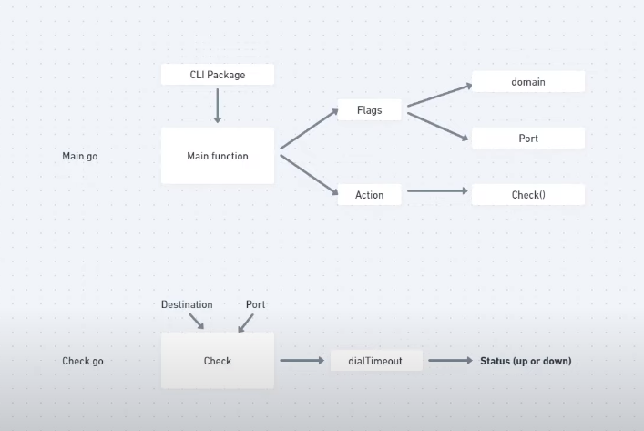
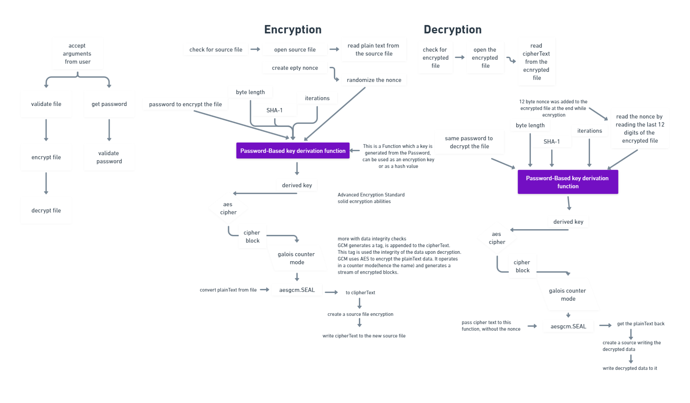

### Improve you Go programming skills by developing three different projects.

link: https://www.youtube.com/watch?v=k_V5VvYSlS4


## go health-checker
```bash
# run command
$ go run . --domain google.com 
# you can use any domain
```


## file-encryption-decryption
